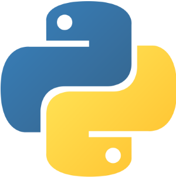

<!--
### Hi there 👋
**Gui-Alucard/Gui-Alucard** is a ✨ _special_ ✨ repository because its `README.md` (this file) appears on your GitHub profile.

Here are some ideas to get you started:

- 🔭 I’m currently working on ...
- 🌱 I’m currently learning ...
- 👯 I’m looking to collaborate on ...
- 🤔 I’m looking for help with ...
- 💬 Ask me about ...
- 📫 How to reach me: ...
- 😄 Pronouns: ...
- ⚡ Fun fact: ...
-->

# Guilherme S. Oliveira   🚀
#### *A full-stack developer*
##### WHAT YOU WILL FIND

- Personal projects
- Curiosities about me
- Developer skills
- Learning activities

 *[Personal Portfolio](https://gui-alucard.github.io/portifolio/) - Work in progress* 
 *[Trybe Repository](https://github.com/Gui-Alucard/Trybe)*

##### A LITTLE ABOUT ME

- :computer:  Currently working for *[Accenture Technology](https://www.accenture.com/br-pt)*
- :heart:  Passionate for technologies and optimizations
- :recycle:  Always learning, practicing and growing up
- :mortar_board:  Physicist, Helicopter Pilot, Designer and Dancer

___
##### MAIN SKILLS
&nbsp;&nbsp;&nbsp;
&nbsp;&nbsp;&nbsp;
&nbsp;&nbsp;&nbsp;
&nbsp;&nbsp;&nbsp;
&nbsp;&nbsp;&nbsp;

##### OTHERS
&nbsp;&nbsp;&nbsp;
&nbsp;&nbsp;&nbsp;
&nbsp;&nbsp;&nbsp;
&nbsp;&nbsp;&nbsp;
&nbsp;&nbsp;&nbsp;
&nbsp;&nbsp;&nbsp;
&nbsp;&nbsp;&nbsp; 
&nbsp;&nbsp;&nbsp;
&nbsp;&nbsp;&nbsp;
&nbsp;&nbsp;&nbsp;
&nbsp;&nbsp;&nbsp;
&nbsp;&nbsp;&nbsp;
&nbsp;&nbsp;&nbsp;
&nbsp;&nbsp;&nbsp;

___
 

&nbsp;&nbsp;&nbsp;

##### FOLLOW ME ON

  
